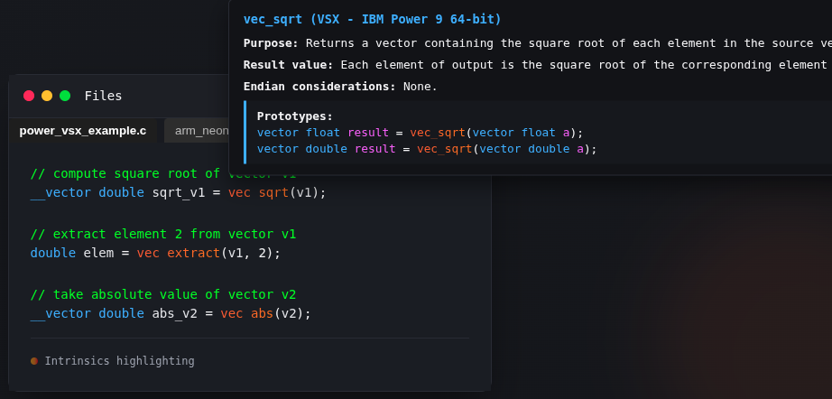
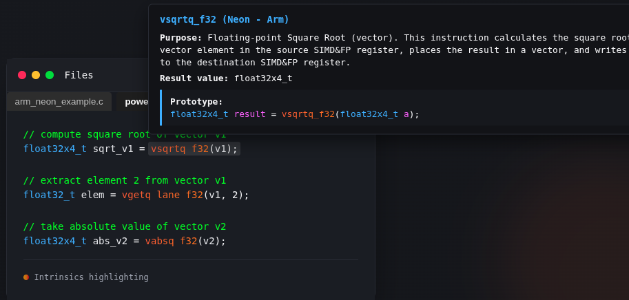
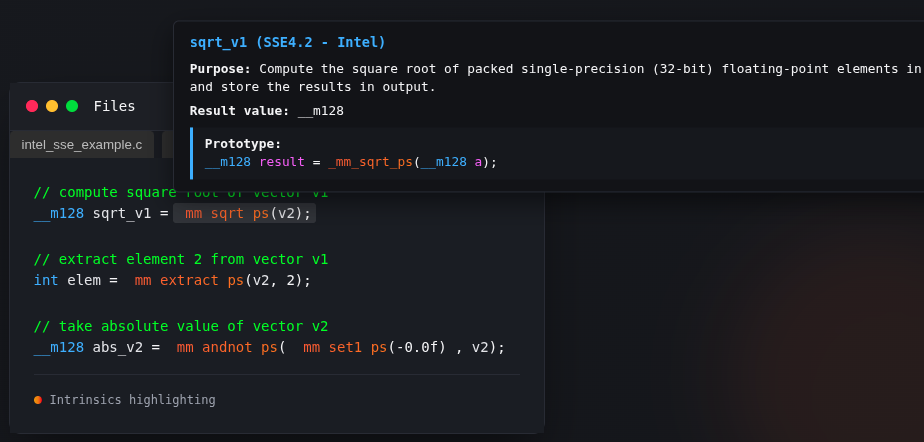

# code.simd.ai README

Supercharge SIMD development directly in VS Code.

AI-assisted SIMD code porting across Intel SSE4.2, AVX2, AVX512,Arm NEON,Power VSX, and more—right inside your editor. Smart intrinsics highlighting, instant conversions, and seamless dev workflow integration.

## Example 1 – VSX

## Example 2 – NEON

## Example 3 – SSE

## Features
- **AI-assisted SIMD Code Porting**  
  Automatically translate SIMD code across architectures like Intel SSE4.2, AVX2, AVX512,Arm NEON,Power VSXin real-time.  

- **Smart Intrinsics Highlighting**  
  Easily read and navigate SIMD intrinsics with syntax highlighting tailored to each architecture.

<video id="demo-video" class="demo-video" autoplay="" muted="" loop="" playsinline="" preload="auto" disablepictureinpicture="" controlslist="nodownload nofullscreen noremoteplayback" src="https://code.simd.ai/images/vids/highlighting_2.mp4">
    <source src="https://code.simd.ai/images/videos/chatting_trimmed_final.mp4" type="video/mp4">
    Your browser does not support the video tag.
</video>

- **AI Chat Sessions**  
  Engage with a specialized SIMD AI for explanations, translations, and architecture-specific guidance. Maintain multiple chat sessions across projects.

<video id="demo-video" class="demo-video" autoplay="" muted="" loop="" playsinline="" preload="auto" disablepictureinpicture="" controlslist="nodownload nofullscreen noremoteplayback" src="https://code.simd.ai/images/vids/ai_chat.mp4">
    <source src="https://code.simd.ai/images/videos/chatting_trimmed_final.mp4" type="video/mp4">
    Your browser does not support the video tag.
</video>

- **Free & Premium Architectures**  
  - Free: Intel SSE4.2 and AVX2) and Arm NEON and Power VSX with brief coverage (~5%)
  - Premium (requires SIMD.ai paid plan): Intel AVX512, Arm NEON, Power VSX

- **Lightning Fast Porting**
  Translate your SIMD code in seconds, saving hours of manual work.

<video id="demo-video" class="demo-video" autoplay="" muted="" loop="" playsinline="" preload="auto" disablepictureinpicture="" controlslist="nodownload nofullscreen noremoteplayback" src="https://code.simd.ai/images/vids/full_translation.mp4">
    <source src="https://code.simd.ai/images/videos/chatting_trimmed_final.mp4" type="video/mp4">
    Your browser does not support the video tag.
</video>

- **Better Results**  
  Based on SIMD.info data for higher accuracy than generic LLMs, including ChatGPT or Claude.

---

## Requirements

- Visual Studio Code (latest stable version recommended)
- Internet connection for AI translation and chat features
- SIMD.ai account for premium architectures and AI translation

---

## Extension Settings

This extension contributes the following settings:

* `code.simd.ai.apiToken`: Your SIMD AI API token. Get it from [https://simd.ai/](https://simd.ai/).

---

## Coming soon
- Some architectures (e.g. Power IBM-Z, RVV 1.0,LOONGSON LSX/LASX, MIPS/MSA,Intel MMX ARM SME, ARM SVE/SVE2  ) are still in development.  

---

## Release Notes

### 0.0.1
- Initial release of **code.simd.ai** with AI-assisted SIMD code porting for SSE4.2, NEON, and VSX.
- Added AI chat sessions for code guidance  

### 0.0.2
- Fixes on Hover Tooltip

### 0.9
- Copyright Vectorcamp 2025
---

**Enjoy SIMD coding made easy! �**
